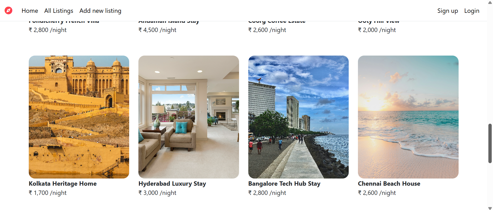
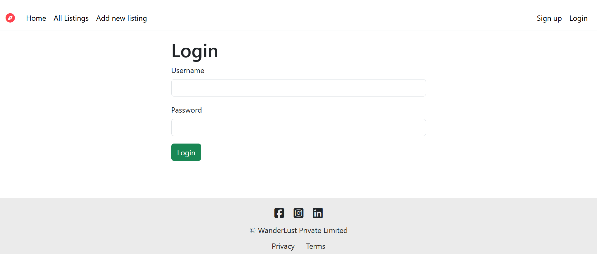
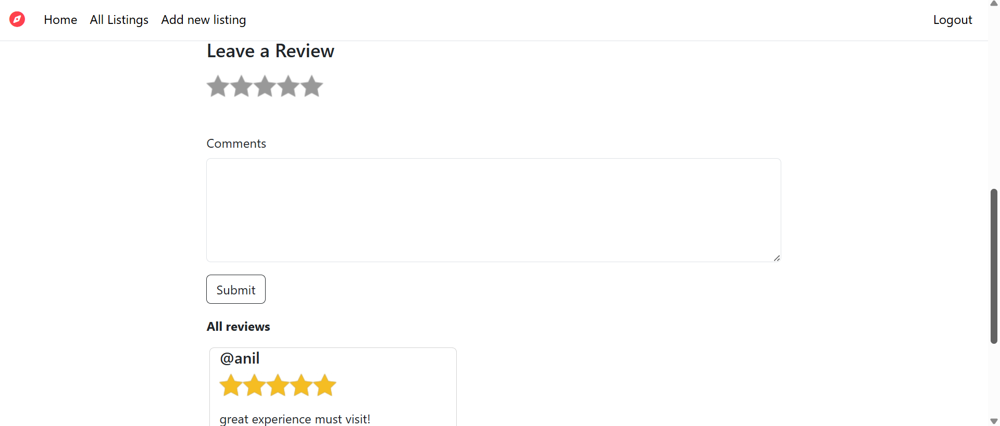

# Wanderlust 🌍
Wanderlust is a full-stack travel listing web application currently under development.
##  Status
This project is in progress (50% completed).
## Features (Completed)
- Basic CRUD operations
- Listing creation
- Backend setup with Node.js & Express
- User authentication
- Reviews & ratings
- UI improvements

##  Tech Stack
- Node.js
- Express.js
- MongoDB
- EJS
Stay tuned for updates!

## 📦 NPM Packages Used
- express – Web framework
- mongoose – MongoDB ODM
- ejs – Templating engine
- multer – File upload handling
- cloudinary – Cloud image storage
- multer-storage-cloudinary – Cloudinary storage engine
- passport – Authentication
- express-session – Session management
- connect-flash – Flash messages
- dotenv – Environment variables
- method-override – PUT & DELETE requests support

## 📸 Screenshots

### Listings Page

### Login Page

### Review Page

